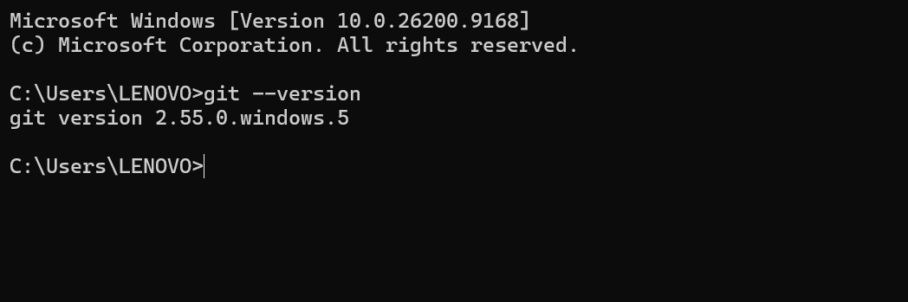
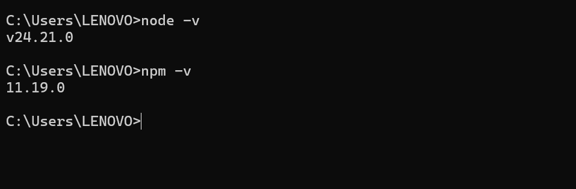
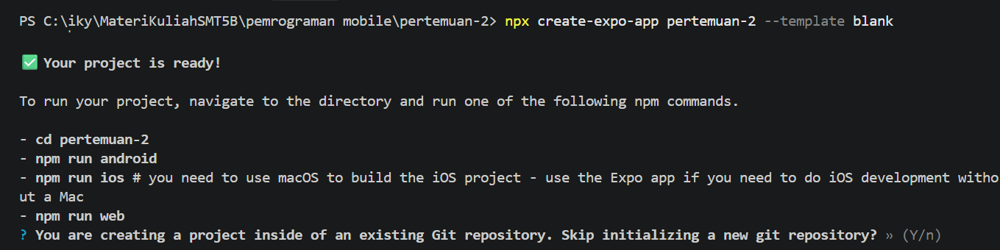
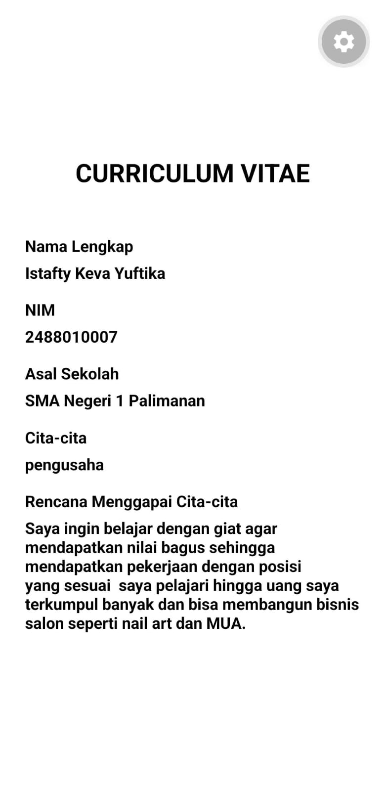

# Praktikum Menyiapkan Lingkungan Pengenmbangan dan Memulai Pemrograman Mobile(React Native) #

## Tujuan Pembelajaran ##
Mahasiswa mampu : 
1. Menyiapkan lingkungan pengembangan dan memulai pemrograman mobile (React Native)
2. Membuat aplikasi mobile dengan React Native
3. Menyelesaikan Tugas CV sederhana dengan React Native

## Materi dan Laporan Praktikum ##
1. Menyiapkan lingkungan pengembangan dan memulai pemrograman moblie (react native)

- Memastikan instalasi Git bash 
- cek instalasi Git Bash(git -- version)
- bukti vertifikasi

()
- Memastikan Node.JS dan NPM
    - Download  di https://nodejs.org/en/download/ 
    - konfirmasi Node.JS dan NPM (node-v, npm, -v)
    

 2. Membuat aplikasi/ Project baru dengan React Native Framework Expo Go
 - Buka dan baca dokumentasi resmi link  https://docs.expo.dev/
 - Buka dan baca dokumentasi resmi link https://reacnative.dev/docs/

 - Memulai Mebuat project baru
 - open terminal chage directory ke pertemuan-2
 - masukan perintah (npx create-expo-app ptmn2 --template blank)
 - bukti vertifikasi 

 3. running projek
    - cd ke ptmn2
    - npx expo start
    - install expo go di android atau ios
    - bisa juga menggunakan web emulator dilaptop / pc
    - setelah  berhentikam (ctrl + C)
    - install (npx expo install react-dom react-native-web)
    - npx expo start --web
    - konfirmasi keberhasilan
   

4. Tugas Praktikum
   - Membuat aplikasi CV sederhana dengan React Native
   - Nama Lengkap
   - NIM
   - Asal Sekolah
   - Cita-cita
   - Rencana Menggapai cita-cita
   - konfirmasi keberhasilan
      
