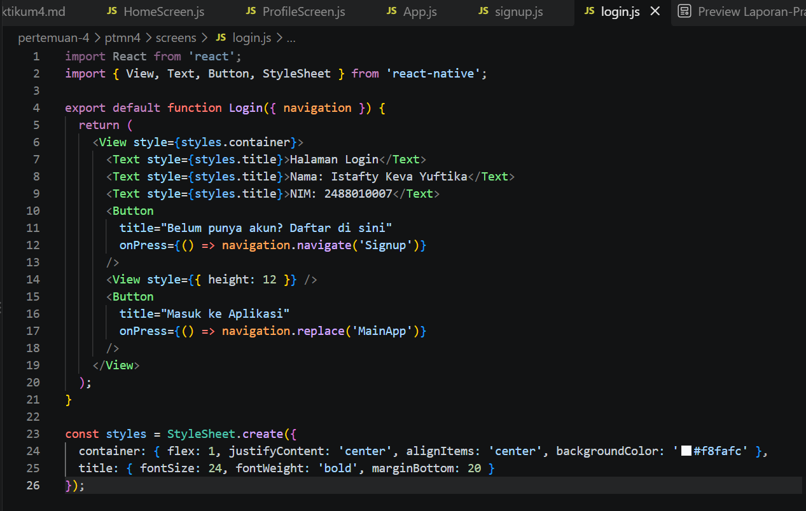
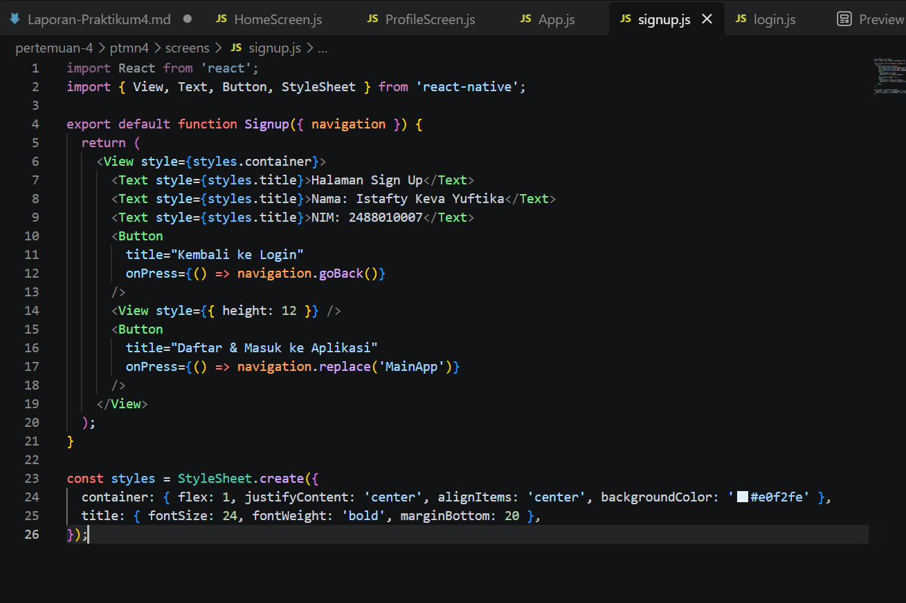
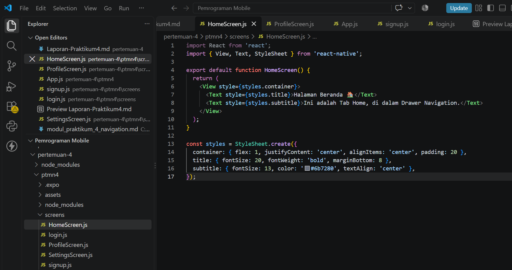
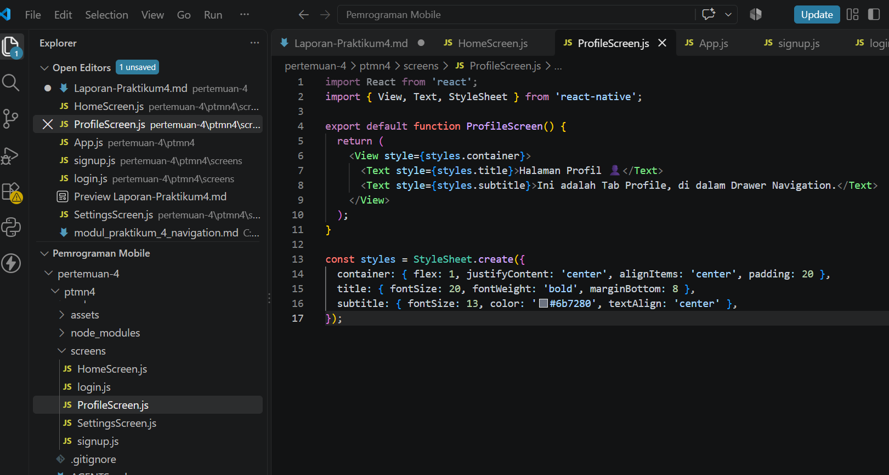
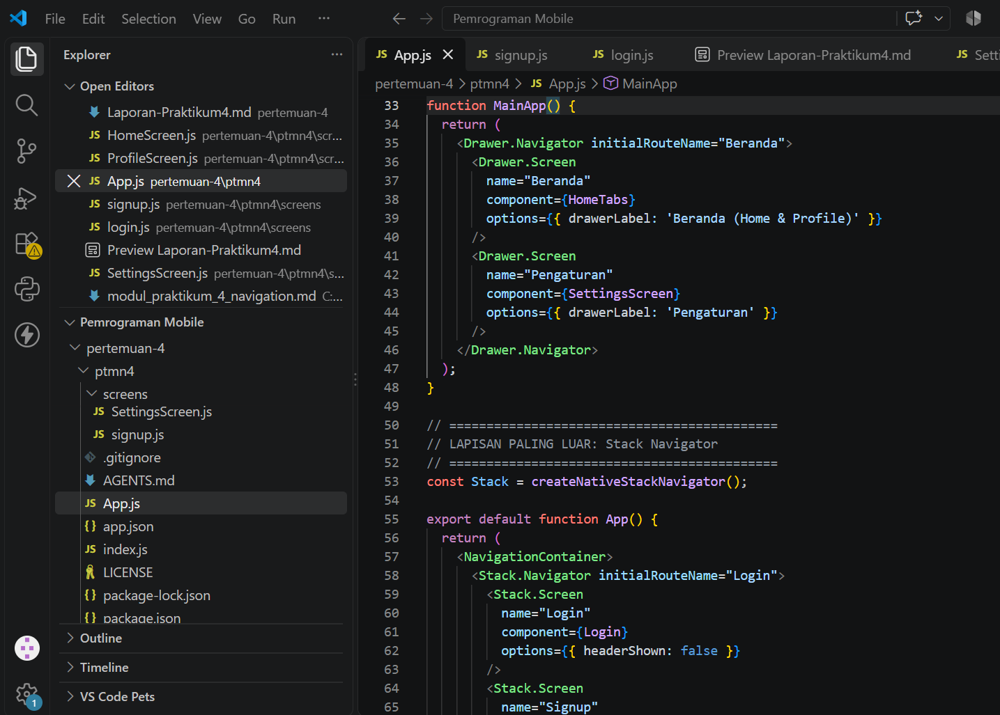
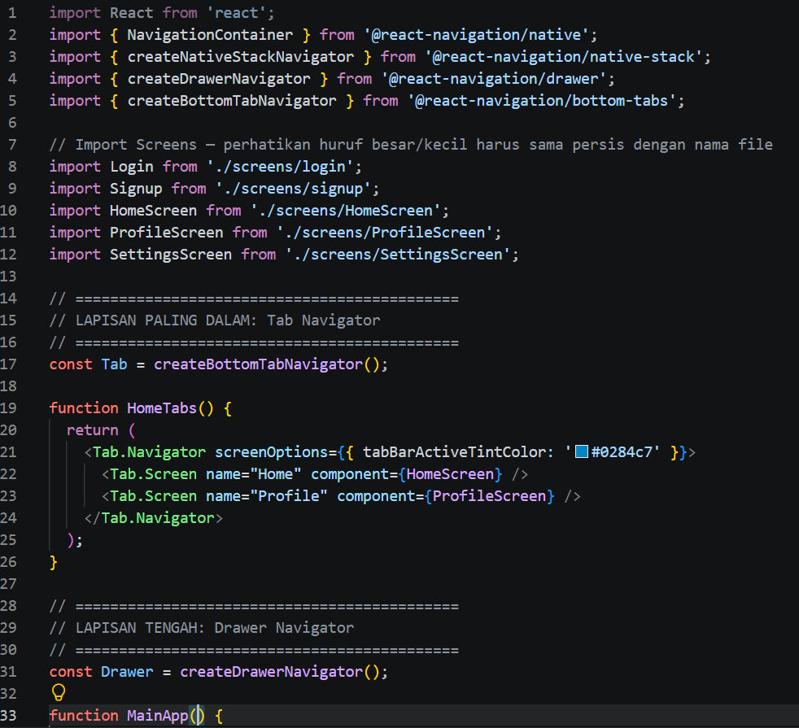
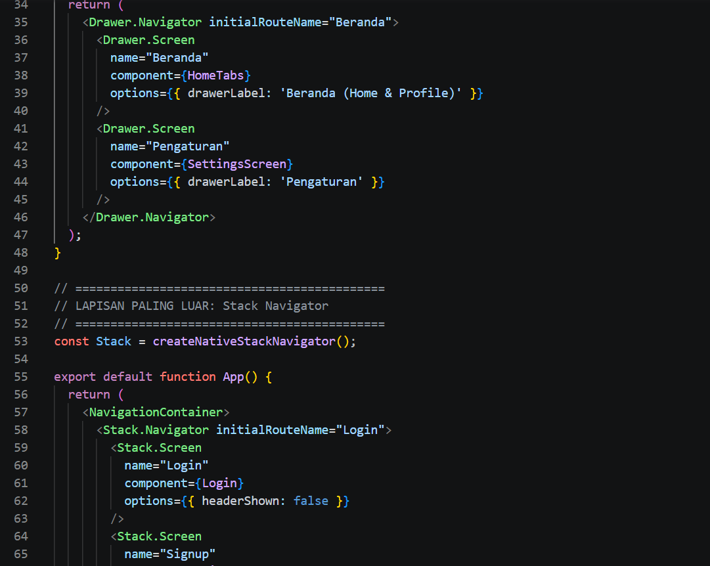
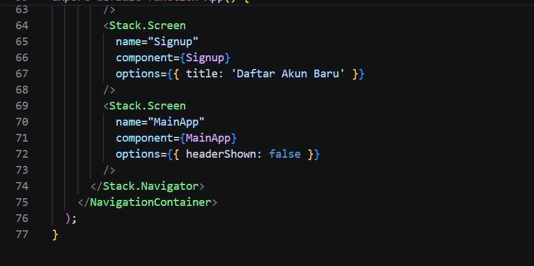

 # Praktikum 4 :  React Native Navigation #

 ## Tujuan Pembelajaran ##
 Mahasiswa mampu : 
 1. Merancang dan menerapkan navigasi antar layar (screen) pada aplikasi React Native
 2. Menggunakan library React Navigation (Stack Navigator, Tab Navigator, Drawer Navigator)

 ## Alur Praktikum ##

 ### Langkah 1 : inisialisasi Proyek React Native ###
 1. Buka terminal atau command promp
 2. Ubah directori ke foler pertemuan 4 (cd "Pemrograman Mobile\Pertemuan-4")
 3. BUat proyek baru menggunakan perintah berikut : 'npx create-expo-app ptmn4 --template blank'
 4. Masuk kedalam folder proyek menggunakan perintah berikut : 'cd ptmn4'
 5. install core navigation library (npm install @react-navigation/native)
 6. install dependensi pendukung (wajib untuk expo) npx install react-native-screens
 react-native-safe-area-context react-native-gesture-handler react-native-reanimated

 ### Langkah 2 : Membuat stack navigator ###
 1. instalasi pustaka stack : npm install @react-navigation/native-stack
 2. Buat folder didalam projek dengan nama screens
 3. didalam folder screens buat 2 file dengan nama login.js dan signup.js
 4. Masukkan kode sesuai dengan modul praktikum 4
 5. sesuaikan dile app.js dengan kode yang ada pada modul 
 6. simpan dan install dispendensi untuk web "npx expo install react-dom-react-native --web"
 7. jalankan perintah npx expo start --web
 8. konfirmasi Bukti
 
 
 
 <video controls src="WhatsApp Video 2026-09-28 at 12.10.54.mp4" title="Title"></video>

 ### Langkah 3 : Membuat Bottom Tab Navigation ###
 1. Instalasi pustaka tab: npm install @react-navigation/bottom-tabs
 2. Di dalam folder screens, buat 2 file baru dengan nama HomeScreen.js dan ProfileScreen.js
 3. Masukkan kode sesuai dengan modul praktikum 4 (bagian D)
 4. Ubah isi App.js, ganti NavigationContainer agar membungkus Tab.Navigator dengan createBottomTabNavigator(), daftarkan Tab.Screen untuk Home dan Profile
 5. Simpan file, jalankan npx expo start --web
 6. Konfirmasi Bukti :

 <video controls src="WhatsApp Video 2026-10-04 at 15.17.57.mp4" title="Title"></video>

 ### Langkah 4 : Membuat Drawer Navigation ###
1. Instalasi pustaka drawer: npm install @react-navigation/drawer
2. Pastikan dependensi react-native-reanimated dan react-native-gesture-handler sudah terinstall (sudah dilakukan di Langkah 1)
3. Ubah kembali isi App.js, ganti navigator menjadi createDrawerNavigator(), daftarkan Drawer.Screen untuk Home (dengan drawerLabel: 'Beranda') dan Profile (dengan drawerLabel: 'Profil Pengguna')
4. Simpan file, jalankan npx expo start --web
5. Geser layar dari kiri ke kanan (atau klik ikon hamburger) untuk memunculkan menu Drawer
6. Konfirmasi Bukti:

<video controls src="WhatsApp Video 2026-10-04 at 15.34.06.mp4" title="Title"></video>

### Langkah 5 : Tugas Praktikum — Nested Navigation (Stack + Tab + Drawer) ###
1. Buat 1 file tambahan di screens, yaitu SettingsScreen.js, sebagai menu khusus Drawer yang tidak muncul di Tab
2. Rancang struktur navigasi bersarang: Stack Navigator (paling luar, berisi Login → Signup → MainApp) membungkus Drawer Navigator (berisi Beranda & Pengaturan), dan Beranda di dalam Drawer berisi Tab Navigator (Home & Profile)
3. Ubah Login.js dan Signup.js, tambahkan tombol "Masuk ke Aplikasi" yang memanggil navigation.replace('MainApp') agar bisa masuk ke navigasi bersarang setelah login/daftar
4. Buat komponen HomeTabs() yang membungkus Tab.Navigator (Home & Profile), lalu daftarkan HomeTabs sebagai salah satu Drawer.Screen di dalam MainApp()
5. Gabungkan semuanya di App(): Stack.Navigator mendaftarkan Login, Signup, dan MainApp (yang isinya Drawer berisi Tab)
6. Simpan file, jalankan npx expo start --web, uji seluruh alur: Login → Signup (Stack) → Masuk ke Aplikasi → Drawer (Beranda/Pengaturan) → Beranda berisi Tab (Home/Profile)
7. Konfirmasi Bukti :

<video controls src="20261004-0858-46.1128842.mp4" title="Title"></video>
